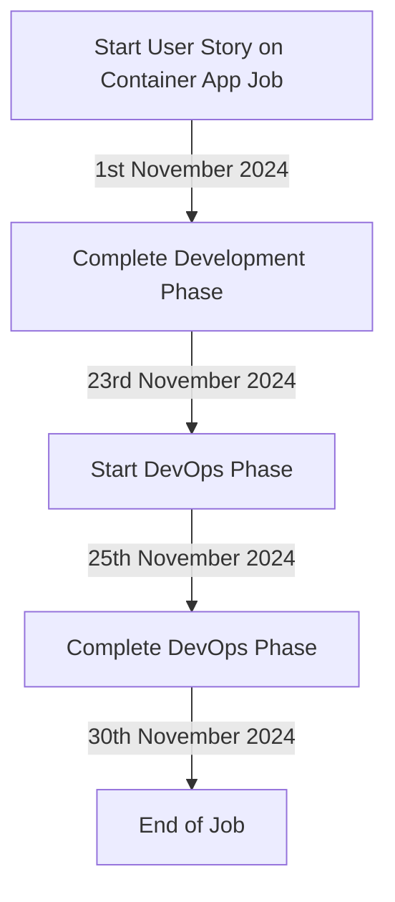

# My Day Looks like  `Monday`
## Words Talks Facts Screams  `Warmup liner`

Today the weather is very *gloomy* and _rainy_   `Mohsam`

I feel like **felicia** today  `Kicker`

## statement
I am a wolf not a ~~lion~~

## Below are the checklist for the day  `workflow`
+ follow the money
+ gain some tech skills
+ love mother and nature
+ build some muscles

## Each activity will have actions like `Apply`
+ follow the money
  - look for some mutual funds to invest.
+ gain some tech skills
  - read about Containerization ( API Interaction )
+ love mother and nature
  - help in cooking and water the plants
+ build some muscles
  - Hit tricep & obliques
 
## Coding Language for the day
```bicep
resource containerappjob 'Microsoft.App/managedEnvironments@2022-11-01-preview' = {
  name: ceJobLibName
  location: cajobLibRegion
  identity: {
    type: 'SystemAssigned'
  }
  properties: {
    appLogsConfiguration: {
      destination: 'log-analytics'
      logAnalyticsConfiguration: {
        customerId: reference(logAnalyticsWorkspaceId, '2020-08-01').customerId
        sharedKey: listKeys(logAnalyticsWorkspaceId, '2020-08-01').primarySharedKey
      }
    }
  }
}
```
## Declaring some footnotes
[^1] and [^2]

## Dish of the day `table`

|Monday|Tuesday|wednesday|Thursday|Friday|Saturday|Sunday|
|------|-------|---------|--------|------|--------|------|
|Paneer|Alu dam|Pulao    |Mix veg |chicken|Tandori|Luchi |

## To do List `task list`
- [x] studied
  - [] Container
  - [X] GHF

## Summary of the Day `collapsed`
<Details>
<Summary>
The day was very fruitful as I stidied a new language.
<summary>
I also did the practicle and pushed it to my repo.
</summary>
</Summary>
</Details>

## Animation of the day  `emojies`
🫀
☁️
🇮🇳
🍭

## Don't `Alert`
>[!warning]
>Don't break my heart

>[!note]
>blind love

## Flow chart `mermaid`


## Favorite social media platform
[ X / Twitter ](https://x.com/home)

## My personality pick today

